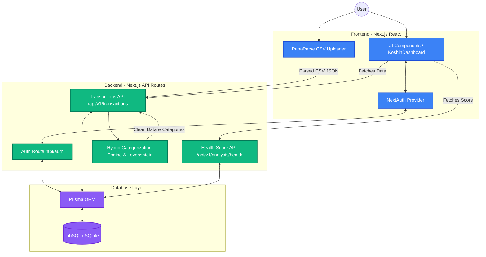

```mermaid
graph TD
    %% Styling
    classDef frontend fill:#3b82f6,stroke:#1d4ed8,stroke-width:2px,color:#fff
    classDef backend fill:#10b981,stroke:#047857,stroke-width:2px,color:#fff
    classDef database fill:#8b5cf6,stroke:#6d28d9,stroke-width:2px,color:#fff
    classDef external fill:#f59e0b,stroke:#b45309,stroke-width:2px,color:#fff

    subgraph Client [Frontend - Next.js React]
        UI[UI Components / KoshinDashboard]:::frontend
        AuthFront[NextAuth Provider]:::frontend
        Upload[PapaParse CSV Uploader]:::frontend
    end

    subgraph Server [Backend - Next.js API Routes]
        AuthAPI[Auth Route /api/auth]:::backend
        TxAPI[Transactions API /api/v1/transactions]:::backend
        HealthAPI[Health Score API /api/v1/analysis/health]:::backend
        NLP[Hybrid Categorization Engine & Levenshtein]:::backend
    end

    subgraph Storage [Database Layer]
        Prisma[Prisma ORM]:::database
        SQLite[(LibSQL / SQLite)]:::database
    end

    %% Flow
    User((User)) --> UI
    User --> Upload
    
    Upload -- Parsed CSV JSON --> TxAPI
    UI -- Fetches Data --> TxAPI
    UI -- Fetches Score --> HealthAPI
    UI <--> AuthFront
    
    AuthFront <--> AuthAPI
    AuthAPI <--> Prisma
    
    TxAPI --> NLP
    NLP -- Clean Data & Categories --> TxAPI
    
    TxAPI <--> Prisma
    HealthAPI <--> Prisma
    
    Prisma <--> SQLite
```
